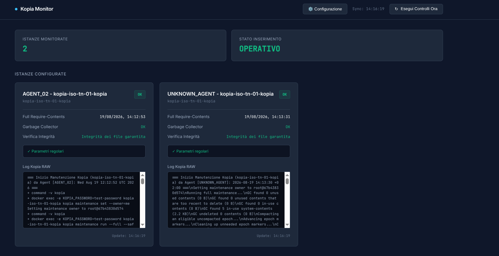

# Kopia Manager 🚀

Un'infrastruttura completa per il monitoraggio e la manutenzione automatizzata di istanze **Kopia Backup**. Il sistema raccoglie metriche, log e allarmi in tempo reale tramite **MQTT** da diversi agenti di manutenzione e li espone in una dashboard web moderna, reattiva e sempre aggiornata.

---

## 🏗️ Architettura del Sistema

Il sistema è composto da tre macro-componenti:

1. **Broker MQTT (EMQX):** Il "centralino" che smista i messaggi tra la dashboard e i vari agenti di backup.
2. **Dashboard di Monitoraggio (.NET & Web):** Raccoglie lo stato di tutti gli agenti tramite MQTT, mostra le card di ristato e permette di inviare comandi di configurazione e manutenzione globali o mirati.
3. **Agenti Kopia (Linux / Windows):** Eseguono script periodici di manutenzione (`maintenance run --full`) e verifica (`snapshot verify`), inviando i log e lo stato al broker. Ricevono inoltre in tempo reale i comandi di configurazione avanzata (es. percentuale di verifica e frequenza dei cron).

---

## 📂 Struttura del Progetto

```text
jdoctor-kopia-manager/
├── app/                      # Codice sorgente della Dashboard .NET
│   ├── Controllers/          # API Controllers (es. ConfigController.cs)
│   ├── Services/             # Servizio MQTT (MqttSubscriberService.cs)
│   └── Program.cs            # Entry point dell'applicazione .NET
├── agent/                    # Script e configurazioni per gli Agenti Linux
│   ├── entrypoint.sh         # Avvio in background del listener e di cron
│   ├── kopia-mqtt-listener.sh# Listener MQTT per ricezione config avanzate
│   └── kopia-weekly-mainte...# Script di manutenzione periodica Kopia
├── docker-compose.yml        # Orchestrazione dei container (Dashboard + EMQX)
└── README.md                 # Questo manuale

```

---

## ⚙️ 1. Configurazione e Avvio del Backend (Docker)

Assicurati di avere installato **Docker** e **Docker Compose** sulla macchina server.

1. Posizionati nella cartella principale del progetto:
```bash
cd jdoctor-kopia-manager

```


2. Avvia i container in background con un build pulito:
```bash
docker compose down
docker compose build --no-cache
docker compose up -d

```


3. **Verifica dei servizi attivi:**
* **Dashboard .NET:** Disponibile su `http://localhost:5000` (o la porta configurata).
* **Broker EMQX:** Pannello di controllo MQTT disponibile su `http://localhost:18083` (se esposto) e porta broker su `1883`.


---

## 🐧 2. Setup degli Agenti Linux (Docker / Container)

Ogni agente Linux gira all'interno di un container dedicato gestito da un file `entrypoint.sh` che avvia in autonomia l'ascolto dei comandi MQTT.

### File `entrypoint.sh` dell'agente:

```bash
#!/bin/bash

# 1. Avvia il listener MQTT in background per le configurazioni dinamiche
/app/kopia-mqtt-listener.sh &

# 2. Avvia Cron in foreground (mantiene in vita il container Docker)
exec cron -f

```

### Script Listener MQTT (`kopia-mqtt-listener.sh`):

Ascolta sul topic `kopia/config/advanced/#` e aggiorna le impostazioni locali (`agent-settings.env`) e il crontab di sistema:

```bash
#!/bin/bash
MQTT_HOST="${MQTT_HOST:-emqx}"
MQTT_PORT="${MQTT_PORT:-1883}"
TOPIC="kopia/config/advanced/#"

while true; do
    mosquitto_sub -h "$MQTT_HOST" -p "$MQTT_PORT" -t "$TOPIC" | while read -r json_message; do
        echo "Ricevuta nuova configurazione MQTT: $json_message"
        echo "$json_message" > /app/agent-settings.env
        
        # Estrazione opzionale ed aggiornamento crontab
        # ... logica di aggiornamento crontab ...
    done
    sleep 10
done

```

---

## 🪟 3. Setup dei Client Windows

Per estendere il monitoraggio e la configurazione dinamica a macchine o container Windows, utilizza gli script PowerShell dedicati.

### A. Listener MQTT per Windows (`kopia-mqtt-listener.ps1`)

Salvalo ed eseguilo in background sulla macchina Windows (puoi registrarlo tramite Utilità di Pianificazione / Task Scheduler all'avvio):

```powershell
$MqttHost = if ($env:MQTT_HOST) { $env:MQTT_HOST } else { "localhost" }
$Topic = "kopia/config/advanced"
$ConfigFile = "$env:TEMP\kopia-agent-settings.json"

Write-Host "Avvio listener MQTT per Windows..." -ForegroundColor Cyan

while ($true) {
    try {
        mosquitto_sub -h $MqttHost -t $Topic | ForEach-Object {
            $jsonMessage = $_
            Write-Host "Configurazione ricevuta: $jsonMessage" -ForegroundColor Green
            $jsonMessage | Out-File -FilePath $ConfigFile -Encoding utf8
        }
    } catch {
        Start-Sleep -Seconds 10
    }
}

```

### B. Script di Manutenzione Windows (`kopia-weekly-maintenance.ps1`)

Eseguito periodicamente (es. tramite Task Scheduler di Windows), legge la configurazione dinamica e invia l'esito al broker MQTT:

* Legge i parametri da `$env:TEMP\kopia-agent-settings.json` (se aggiornati via MQTT).
* Esegue il Garbage Collector e lo `snapshot verify` con la percentuale dinamica.
* Invia il report strutturato in JSON al broker EMQX tramite `mosquitto_pub`.

---

## 🔌 4. API e Test del Sistema

Puoi testare l'invio di una configurazione avanzata (es. modifica della percentuale di verifica dei file al `0.005%`) chiamando l'endpoint della dashboard .NET:

```bash
curl -X POST http://localhost:5000/api/config/advanced \
     -H "Content-Type: application/json" \
     -d '{"VerifyPercent": 0.005}'

```

La dashboard pubblicherà il comando via MQTT sul topic `kopia/config/advanced`, il quale verrà intercettato all'istante da tutti gli agenti (Linux e Windows), aggiornando i loro file di configurazione locali in tempo reale.

---

## 🛠️ Risoluzione Problemi (Troubleshooting)

* **Connessione MQTT rifiutata (`Connection refused`):** Assicurati che il nome host del broker nei servizi sia `emqx` (se all'interno della stessa rete Docker) o l'IP corretto della macchina se eseguito dall'esterno.
* **Il listener non riceve i messaggi:** Verifica che il topic configurato nel listener corrisponda esattamente a quello pubblicato dal controller .NET (`kopia/config/advanced`). Utilizza `mosquitto_sub` da terminale per monitorare il traffico sul broker in tempo reale.